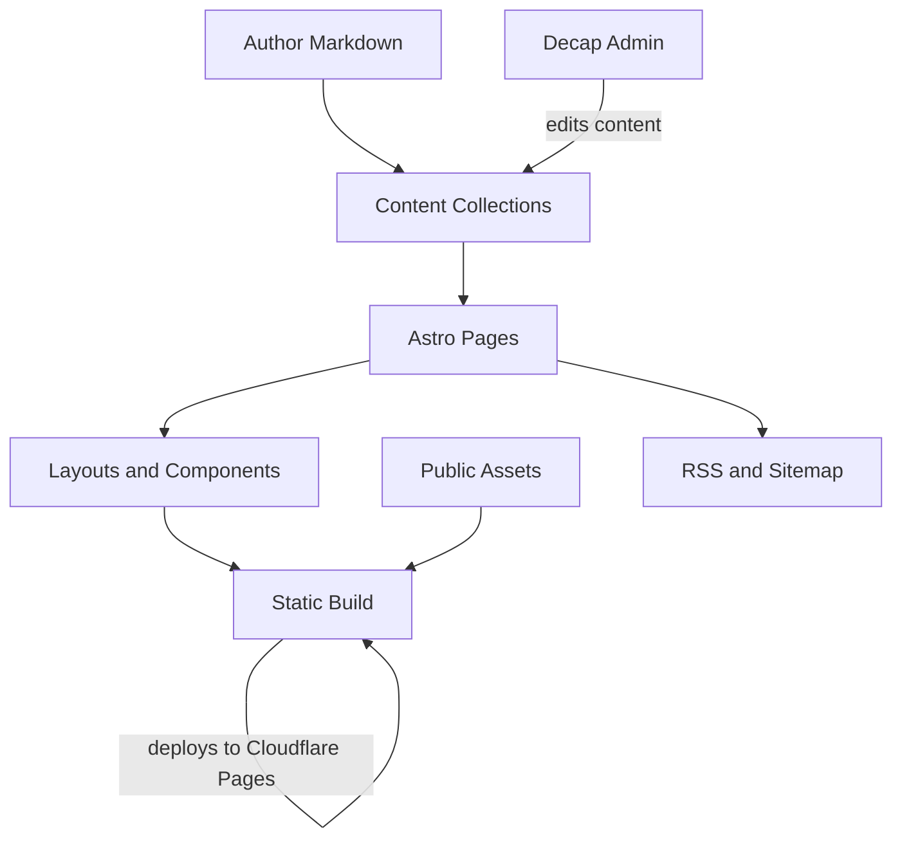

# Blueprint: savvautops/nano-nodes

_Auto-generated architectural documentation — 2026-09-24 (Phase 1). Built from the repository file tree, README and manifests._

## Diagram

## How it works

nano-nodes is a static blog built with Astro 6 and Tailwind CSS 4, publishing lab documentation for the nano-nodes hobby hub ("Build Small. Run Local. Own."). Content lives as Markdown files in typed Astro Content Collections (`src/content/blog`, `gear`, `tutorials`) — each article is frontmatter plus Markdown, rendered through `.astro` page routes.

Pages compose shared layouts (`BlogPost.astro`, `BaseHead.astro`) and components (`Header`, `Footer`, `HardwareCard`) into full HTML at build time (`astro build` → `dist/`). There is no server at runtime: the output is static files deployed to Cloudflare Pages. RSS (`rss.xml.js`) and sitemap generation are built into the build. A Decap CMS admin (`public/admin/`) gives a browser-based editor for the Markdown content without touching git directly.

## Key files

- `src/content/` — all articles: `blog/`, `gear/`, `tutorials/` collections
- `src/content.config.ts` — content collection schemas and config
- `src/pages/` — routes: `index.astro`, `about.astro`, `[...slug].astro` renderers
- `src/layouts/BlogPost.astro` — article page layout
- `src/components/` — `Header`, `Footer`, `HardwareCard`, `BaseHead`
- `public/admin/` — Decap CMS browser editor (`config.yml`, `index.html`)
- `astro.config.mjs` — Astro, MDX, RSS, sitemap integrations
- `src/pages/rss.xml.js` — RSS feed generation

## For the owner

This is the nano-nodes website source: you write articles as simple Markdown files, and Astro turns them into a fast static site that deploys itself to Cloudflare Pages. No server to maintain, no database — publishing is just adding a Markdown file. The built-in admin panel lets you edit posts from a browser like a mini WordPress, while the RSS feed and sitemap keep readers and search engines in the loop.
